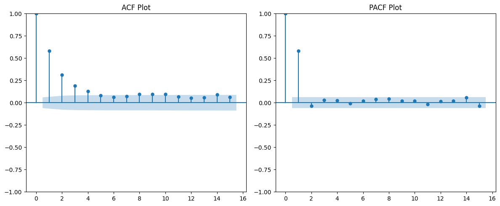
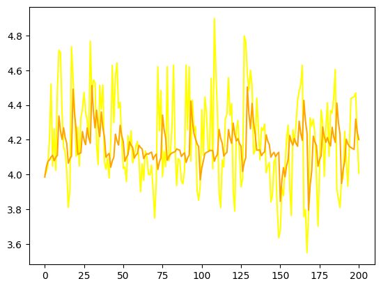
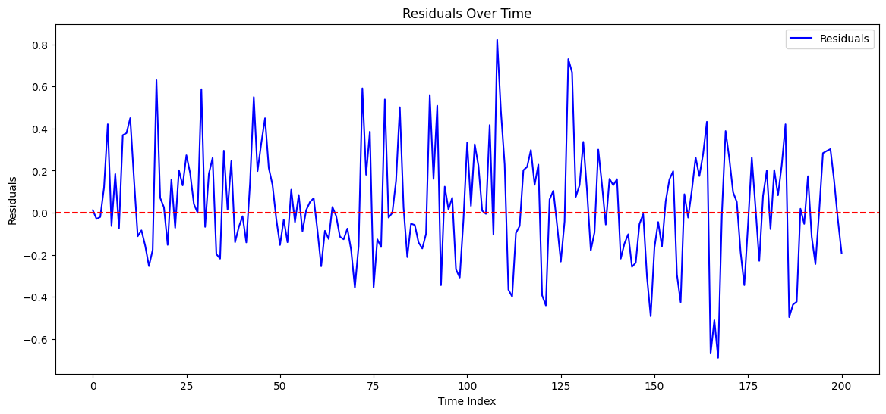
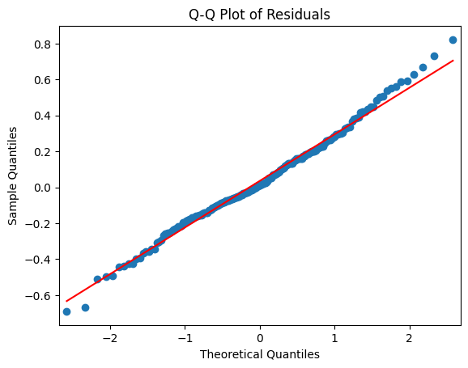

# Air Quality Predictor for my hometown Baku

A  time series machine learning model that predicts the AQI for the three upcoming days for  my hometown Baku, Azerbaijan

## What is AQI and Why it matters?

The Air Quality Index (AQI) is like a health checkup for the air you breathe. It’s a number that tells you how clean or polluted the air is and how it might affect you.If the AQI is "Good," the air is fresh and safe. If it’s "Hazardous," it’s best to stay indoors because breathing could be harmful. This number is based on pollutants like tiny particles (PM2.5) and gases such as ozone and carbon monoxide. Think of AQI asyour guide to decide whether it’s safe to enjoy outdoor activities or take extra care for your health

## Overview of how the application works

Main algorithm of the machine learning model-

This machine  learning model uses a rolling forecasting approach.
Rolling forecasting is a method used to make predictions by using past data in a step-by-step manner. Imagine you predict the weather for tomorrow based on today's data. Once tomorrow arrives, you use that new data to predict the next day, and so on. This way, the model keeps updating its predictions as new data comes in, making it useful for real-time forecasting.

The application is built on two main pipelines.

1. Feature pipeline
2. Training pipeline

*Feature pipeline* is responsible for sending request to an api,  for the historical AQI data. This pipeline is run once in three days  by github actions, it updates  the historical dataset, for training.

*Training pipeline* is responsible for data cleaning, transforming and making predictions.

## More technical explanation of training pipeline

Steps:

1. **Data is read, and plotted**
2. **The dataset is  resampled into daily average AQI values**
   *Explanation*: The  aim of this machine learning model is to predict the  average daily  AQI for the next three days,  but the available data is given in hourly format. To get an average  daily value ,all hourly AQI values  for a day are  summed and divided by their number.
3. **Stationarity test.**
   To  check whether this  time series is suitable for ARIMA model. We perform  Augmented Dickey Fuller Test (ADF). Here is the result of the ADF test:
   ```ADF Statistic: -16.935560656471242 p-value: 9.704032559344054e-30 Critical Values: {'1%': np.float64(-3.436528314312484), '5%': np.float64(-2.86426792284943), '10%': np.float64(-2.568222448164332)} ```
   Interpretation: The ADF test strongly suggest that time series is stationary for the following reasons

   1. The ADF statistics -16.93 is  way smaller than the critical values at all levels
   2. The p-value is nearly zero, providing a strong evidence that   we can reject the null hyphothesis.
4. **Log transformation and  removing outliers**
   These transformations resulted  more accurate  model results.
   The RMSE before transformations: 36
   The RMSE after transformations: 19
   Also  AIC and BIC scores  significantly decreased.
5. **Choosing the model**
   To choose the best ARIMA model. first I had a look at PACF plot

   The pacf plot suggests that  the best  predictor for the  next day is the day before, therefore we can  choose 1 as autogressive component p=1.
   Integrated component of  ARIMA model is choosen to be 0, since  we had a strong evidence that our time series is stationary d=0.
   For the moving average  component of  the ARIMA model. I have conducted AIC  and BIC test and the lowest value occurs  when this component is zero q=0
   The choosen model - ARIMA (1,0,0).
   Now we can plot our predictions along with original data.
   

   The model seems to capture the general  trend without overfitting (Orange line  is predictions, yellow line is the original data).
   6. **Residual analysis**

   Residuals  have a mean  of 0.035 which is very close to zero, as expected
   
   Residuals closely follows a normal distribution
   7. **Model summary**


   | Metric                 | Value            |
   | ---------------------- | ---------------- |
   | Dependent Variable     | - 1047           |
   | Model                  | ARIMA(1, 0, 0)   |
   | Date                   | Mon, 09 Dec 2024 |
   | Time                   | 21:53:01         |
   | Sample                 | 0                |
   | No. Observations       | 1047             |
   | Log Likelihood         | 11.940           |
   | AIC                    | -17.881          |
   | BIC                    | -3.020           |
   | HQIC                   | -12.245          |
   | Covariance Type        | opg              |
   | coef                   | 4.1411           |
   | std err                | 0.018            |
   | z                      | 233.270          |
   | P>                     | z                |
   | [0.025 0.975]          | [4.106 4.176]    |
   | ar.L1                  | 0.5810           |
   | 0.025                  | 23.012           |
   | 0.000                  | 0.532            |
   | 0.631                  | -                |
   | sigma2                 | 0.0572           |
   | 0.002                  | 26.479           |
   | 0.000                  | 0.053            |
   | 0.061                  | -                |
   | Ljung-Box (L1) (Q)     | 0.41             |
   | Jarque-Bera (JB)       | 69.51            |
   | Prob(Q)                | 0.52             |
   | Prob(JB)               | 0.00             |
   | Heteroskedasticity (H) | 0.82             |
   | Prob(H) (two-sided)    | 0.07             |
   | Skew                   | 0.19             |
   | Kurtosis               | 4.21             |


   |  |  |  |
   | - | - | - |

   Key insignts


   * **Model Fit**:
     * The ARIMA(1, 0, 0) fits the data reasonably well, as suggested by low AIC and BIC values.
   * **Significance of Parameters**:
     * All parameters (constant, AR(1), and sigma²) are statistically significant, with p-values < 0.05.
   * **Residual Diagnostics**:
     * No significant autocorrelation in residuals (Ljung-Box test).
     * Residuals are slightly skewed and leptokurtic (heavier tails).
